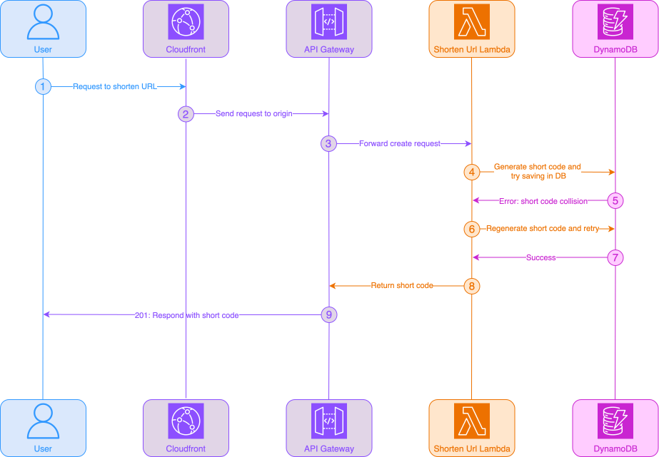
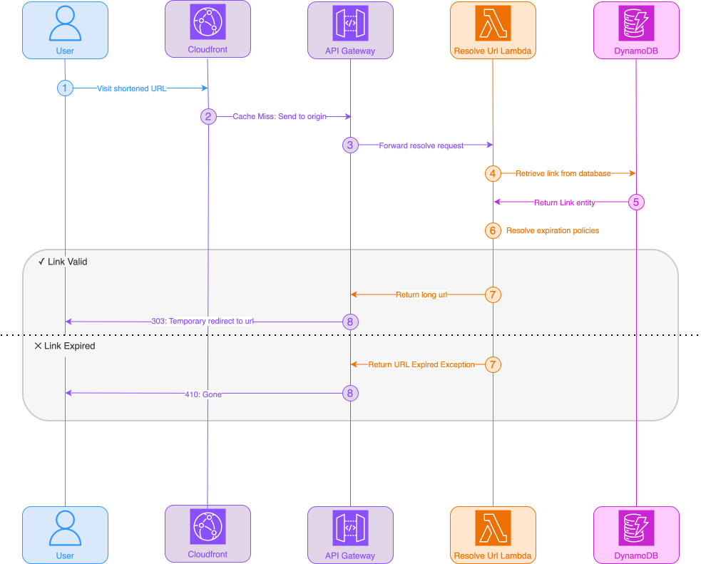
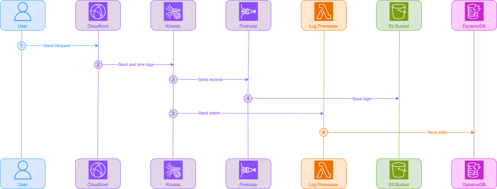

# URL Shortener

An exercise inspired by the System Design Interview [book](https://bytebytego.com/courses/system-design-interview/design-a-url-shortener) by Alex Xu.

## Problem

Build/design a high scale URL Shortening service similar to tiny url or bitly

The expected scale is:

- `100_000_000` new urls created per day
    - Requests per second: ~1200
- `1_000_000_000` redirect requests per day
    - Requests per second: ~12000
- The service will run for 10 years and should be able to store all URLs for that time for a total of 365B rows
- Assuming 200 bytes per row the total storage required would be: `200 bytes * 365B = ~75TB` with some wiggle room

## Features

- Creating a short url
- Redirecting from a short url to a long url
- Expiration policies for links
    - one time link i.e., expires after one visit
    - maximum age link e.g., expires after 30 days
- Telemetry 
    - Counting visits

## Architecture

For this exercise I've opted to use serverless solutions to avoid having to configure a vpc, servers, containers etc. 
and to optimise the cost for myself as serverless solutions usually have a very good free tier rather than optimizing
costs for the actual scale I'm building for. I cover this in more detail in the [cost estimation section](#cost-estimation)

To make a scale like this possible, it requires an aggressive caching strategy to avoid extra costs of computing each
request individually for that reason the API Gateway is fronted by the Cloudfront CDN which will return cached responses
whenever possible, in this case that's a redirect to the appropriate URL. In case of a cache miss, we invoke a relevant lambda
function through an API Gateway integration. The two use cases are in separate lambdas rather than a lambdalith to avoid
having to share resources between the two especially since there's potentially 10x more requests to resolve a short code
than to create a new one in the worst case scenario or without caching. Both lambdas integrate with a DynamoDB table to
store/retrieve short codes, urls and expiration policies.

Once the response is served from the CDN, whether it's a Cache Hit or Miss, Cloudfront streams logs to a Kinesis Data Stream
for processing. A lambda function picks up the logs in batches and aggregates the visits in four granularities in the
DynamoDB table to provide analytics data*. AWS Firehose picks up the same stream of logs and archives it in an S3 bucket.

> *DynamoDB is not a good choice for analytics data as it's an OLTP system, this was just a convenient solution for me in
this exercise, however, at the proposed scale it'd be cost prohibitive to use it this way.
An OLAP database can injest data from the S3 bucket to make it an economically viable system for providing link analytics. 

### Create url request flow

User makes a request which is sent to the Cloudfront CDN and is then proxied to the origin.
The API Gateway forwards the requests to the Lambda service which triggers an invocation. The handler has to generate
a unique short code that will map to the URL in the request. The uniqueness is enforced by DynamoDB. In case of a
collision the lambda will repeat the generation process. Once the unique shortcode is saved in the database, a 201 HTTP
response is returned to the user with the short code.

### Resolve shortcode request flow

User visits a shortened url e.g., https://exanub.es/Av7i12xWq4b which sends a request to the Cloudfront CDN. If it's a cache-hit
Cloudfront will immediately return the cached response and redirect the user to the long URL.

Otherwise, it forwards the request to origin - API Gateway - which forwards it to the Lambda integration. The lambda has
to retrieve the link from DynamoDB and the resolve its expiration policies. If the link is still valid, it will send a 
303 HTTP status code for a Temporary Redirect to avoid browsers caching the response which would affect telemetry.

If the link is expired, it sends a 410 Status code to differentiate from a link that does not exist in the database i.e., 404 response

### Visit aggregation pipeline

The visit aggregation pipelines relies on Cloudfront's Real Time logs that are sent to a Kinesis Data Stream. In my current
implementation I have two consumers, Firehose for storing raw events in an S3 Bucket and a lambda processor for aggregating
the visits in four granularities - hour, day, month, year - in DynamoDB. This is a trade off I've made to have visit aggregates
for cheap in development despite the fact that doing it this way at the proposed scale would skyrocket the cost of the system. 
More on that in the [implementation section](#aggregating-visits).

## Implementation

My implementation follows DDD principles in combination with Ports and Adapters architecture. I've demarcated
a single Link aggregate which consists of the link entity, a few value objects - Url, ShortCode and PolicySpec - and couple
time-based properties.

### Create URL

When user wants to create a new short url, it needs to at least provide the target URL that's supposed to be shortened, but
can also define expiration policies.

#### Expiration Policies

The two implemented policies to choose from are MaxAge e.g., 30 days and OneTime for links
that can only be consumed once. However, it would be fairly simple to introduce many other policies like password protected links,
links that are authenticated through an Identity Provider, links that are created early but enabled from a particular
datetime. The policies could also be used to disable a link temporarily without having to change the database model. It's
a fairly flexible model.

PolicySpec is owned by the Link entity as rehydrating a link from a database without its policies would create an invalid
Link aggregate and could result in expired links being errounously used.

#### Shortcode generation

Reliably generating a url shortcode has turned out to be the biggest challenge. There are basically two parts for generating
a short code - generating a number and encoding it, usually into base62 that's 0-9a-zA-Z. This means that 61 is Z, 62 is 10, 10 is a - we use
62 characters to represent numbers instead of the usual 10.

Then there's the storage consideration of 365B records i.e., unique short codes. Since each character in the shortcodes
has 62 options we can count how many available numbers there are for n length by exponentiating 62. So $62^2$ is 3844
short codes. Long story short, we need a minimum of 7 characters for a $62^7$ total short codes (3.5Q).

First attempt was just incrementing a counter, however, I had two problems with it. First of all, it would require
some sort of synchronization via a database and managing multiple "buckets" to avoid the hot key problem in a distributed system and second, it introduces sequentiality to the 
generated shortcodes.

Second attempt, I tried generating a random number in the $62^7$ number space which worked just fine for me. There was
no sequentiality, it generated completely random short codes and it seemed overall the right solution. However, I wasn't
aware of the [birthday problem](https://en.wikipedia.org/wiki/Birthday_problem) which states that once you've generated a
square root of numbers out of all the available numbers, the probability of generating the same number again exceeds 50%. 

$$\sqrt{62^7} = 1876596$$

At the rate of ~1200rps that's around 26 minutes of the system running before we reach that threshold. So, reluctantly,
I figured maybe if I increase the number space, it'd be OK. Even if I increase it to $62^{11}$ it would only take around 7.2B
short codes and the scale is supposed to be 365B. This disqualified this approach for me.

Next, I've decided to focus on having a reliable deterministic unique id rather than on keeping the short code at 7 characters
and tried snowflake id adjusted for the Lambda environment. I had 41 bits for timestamp, 10 bits for worker id and 12
bits for sequence. This worked great, I had a deterministic, unique ID generation that will work in a highly distributed system
that circumvents the birthday problem. However, it was sequential again.

Last but not least, I combined the snowflake id with a Feistel Network algorithm to scramble the number before base 62 encoding
it. The Feistel Network alogorithm keeps the same characteristics of the number it scrambles - scrambling a random number 
will run into the birthday problem the same way - as it is a reversible algorithm so each unique number produces a different unique number.

This approach results in a unique, non-sequential short code that's 11 characters long due to relying on a 64-bit snowflake id.

> I've also considered shortening the timestamp to be a UNIX epoch in seconds to try and fit in the $62^7$ space which is
42bits. An epoch is 31bits, which leaves ten for sequence and machine id which is very little. Even if all 10 bits went to
sequence that's a maximum of 1024 requests per second which is far below the ~1200rps requirement and normally you'd want at least a 2x breathing room.

#### Handling collisions

The only reliable way to actually verify if the short code is unique or not, is the database. There's no way around it and
because of the large scale it needs to be an atomic operation, a unique constraint on a column in an SQL table is perfect for this.
In DynamoDB it can be achieved with a condition expression that checks that the PK and SK attributes don't exist for this short code.
I consider a short code collision a domain error so I've created a sentinel error for this and regenerate the short code
if it occurs.

### Resolve URL

When user visits a short link, it should redirect to the long url after verifying expiration policies. To do this, I
had to rehydrate the Link Aggregate with its policies to make sure the link can be used.

#### Resolving one-time links exactly once

To ensure that a link is resolved exactly once in a distributed environment, I couldn't rely on application code. Similar
to validating short code uniqueness with a database, here I've also opted for ensuring consistency through a database.

To achieve this I've created an Atomic operation in DynamoDB for updating the `consumedAt` property for a link, but only
if the attribute does not exist for that link using a Condition Expression in DynamoDB. If the condition fails, DynamoDB
returns an error which is then translated to a domain error. So, even if two users click a one time link at the same time,
only one of them will be redirected.

> Implementing similar behaviour in an SQL database could be achieved by returning the number of updated rows from an 
atomic UPDATE query. If it's zero, it means it was already consumed and should return an error response 410 Gone.

#### Caching

In such a read heavy system, caching is a must, but it's not very obvious how to do it while at the same time maintaining
reliable telemetry data e.g., how many times a link was visited, geolocating visits by IP etc. Using a in-memory cache,
especially when using DynamoDB, seemed like more of the same. Not really helpful, and it doesn't really fix the problem
of wasting compute on every request to resolve a short url. API Gateway and Lambda are the biggest money wells in this design
and if application code is responsible for emitting events that's another big chunk of the budget.

I've opted for putting a CDN in front of the API Gateway. This way, cached requests will never even go beyond Cloudfront
and hit API Gateway or Lambda, but this introduced another problem: how can I count visits? To remedy this, I've used
Cloudfront's Real Time Logs feature and streamed all the logs to a Kinesis Data Stream.

However, another issue is that we now return Cache headers in the response which might cause the browser to cache the 
requests and not even send it to the CDN. This can be prevented by using a s-maxage in the Cache-Control header which
is used only by shared caches like CDNs and overrides the max-age property if both are set.

### Aggregating visits

Doing anything 1 billion times a day will always be a challenge. I've prepared two solutions, one that I used for completing
the feature in the tiny scale of a development environment using a lambda for processing event batches coming from the 
Kinesis Data Stream filled with Cloudfront Realtime Logs and saving counts to DynamoDB. Second, more scalable and economically
viable approach, uses Data Firehose to stream logs from Kinesis to S3.

Challenge: Aggregating 1B visits per day 

#### Lambda + DynamoDB

Due to my choice of DynamoDB the additional challenge is that it's not very good at aggregating data just-in-time. DynamoDB 
has a hard limit of returning a maximum of 1Mb responses, so would require pagination in order to gather all visit metadata
if it was saved as raw visit events - one per row. This would be wasteful on both fronts - storage and IO. To avoid this
I elected to save projections for the time granularities that my imaginary dashboard would support - hour/day/month/year. 
So, on every visit, I would create an atomic operation creating/updating all four buckets.

This solution will do its job, however, under heavy load it could start throttling if there's a popular key that's updated
very frequently, also known as the hot key problem. If a celebrity with tens or hundreds of millions of subscribers/followers
shares a link, it will receive a large amount of traffic in a short amount of time right after posting. So if all this
traffic attempts to update that same key in the database, DynamoDB might start throttling which has to be handled in
application code. To avoid having this problem, I split each bucket into ten shards and then if I wanted to serve the
data, I'd need to aggregate the 10 shards. A simple and relatively small aggregation like this can be handled by DynamoDB
just fine and it won't exceed the 1Mb response limit.

#### Firehose + OLAP

DynamoDB is an OLTP system so it wasn't made for handling an aggregation or analysis of large datasets. It's a key value
store and that's what it excels at. A more realistic solution would be to stream data from Kinesis to an S3 bucket using
Data Firehose and then use an OLAP database for aggregating the data. Apache Druid or Clickhouse databases would be far 
more efficient at aggregating data at probably 1/10th of the cost. 

To optimise it further, AWS Data Firehose can be used to save logs in the parquet file format. This will both lower
the storage and throughput requirements in S3 thus lowering costs. On top of it, OLAP systems are optimized for handling
parquet and other columnar file types because it aligns with their internal architectures making data injestion and queries
much faster.

## Cost estimation

TODO: Refine

The biggest cost will be:
- CDN
    - The bulk of the price of cloudfront is the 1.1B requests per day that cannot be avoided and this comes out to ~$33'000 per month
    - Additional costs for transfer is another ~$2600
    - Total: ~$36000
    - The greatest cost benefit of using a CDN is that we do not send all of the 1.1B requests to origin, saving on additional cost on other parts of the infrastructure
- API Gateway
    - Assuming a cache-hit rate of 95%, 50M redirect and 100M new url requests will have to be handled by the API Gateway
    - This comes out to ~$4100 
    - If we weren't caching at the CDN it would be ~$30000 + additional lambda and dynamodb charges for handling billions more invocations and
    database queries a month

- Storage
    - Scale
      - Assuming around 200bytes per row * 350B rows over ten years = 70TB of storage required
      - 100M new urls created each day
      - 1B redirects, assuming aggressive caching resulting in 50M reads each day
      - The visits are aggregated into buckets for an additional of 1B Updates in the database for a total of:
      - 1.1B writes and 50M reads so it's a very write heavy application
    
    - On demand dynamodb
       - For us-east-1 dynamodb charges $0.25 per GB for a total of ~$18000/month
       - For 1.1B writes each day we'll have to pay in total $21000/month
       - 50M reads is under $100/month
       - Grand total of ~$39000/month for on-demand Dynamodb

    - provisioned capacity dynamodb
      -  For provisioned capacity in dynamodb:
      -  the storage stays the same
      -  Write capacity for 10K WCU is $15'000 up front for a year and then ~$1000/month
      -  Read capacity for 300 RCU is ~$90 up front for a year and then ~$7/month

    - Some other options would be:
       - RDS that would require an upfront payment for reserved capacity of ~$100000 and then ~$18000/month
       - Aurora which would require an upfront payment for reserved capacity of ~$57000 and then ~$14000/month
       - DocumentDB is ~$17000/month but with a single instance of 32 vCPU's and 256GiB of memory, each additional instance is another ~$3000/month

    - None of these data stores are well suited for this type of data, clickhouse would be a much better choice for analytics at a tenth of the price or even less (OLTP vs. OLAP)

    
[AWS Calculator Estimate](https://calculator.aws/#/estimate?id=28d3f1350fe8a88958a982ee9306ddd125ec1458)
